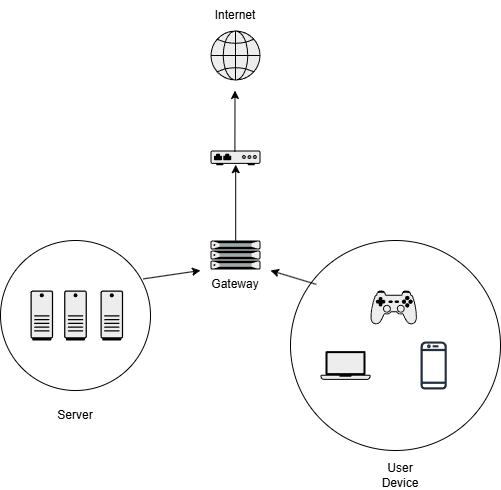
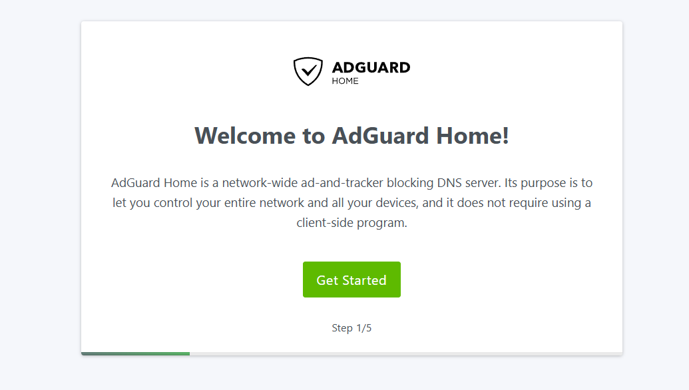
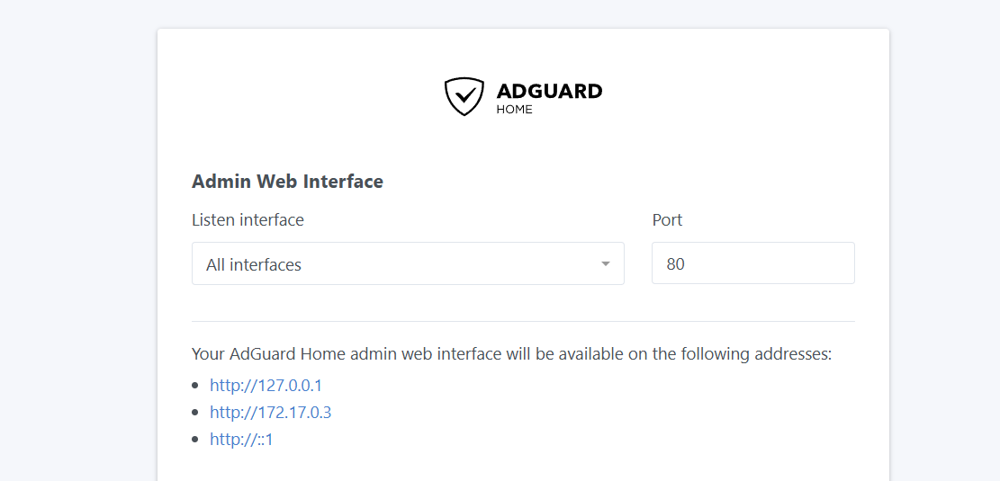
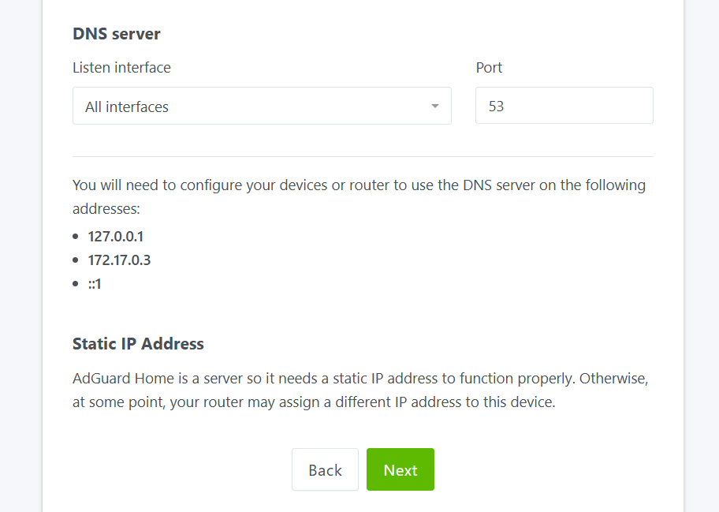
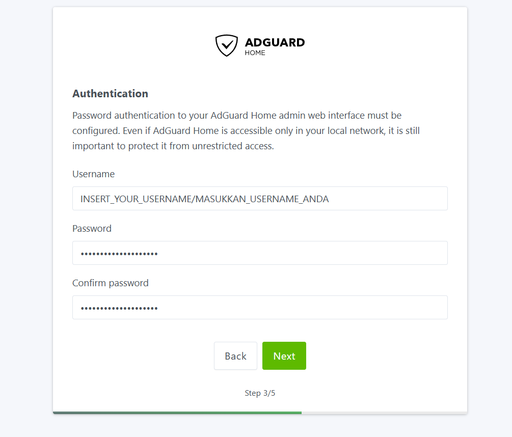
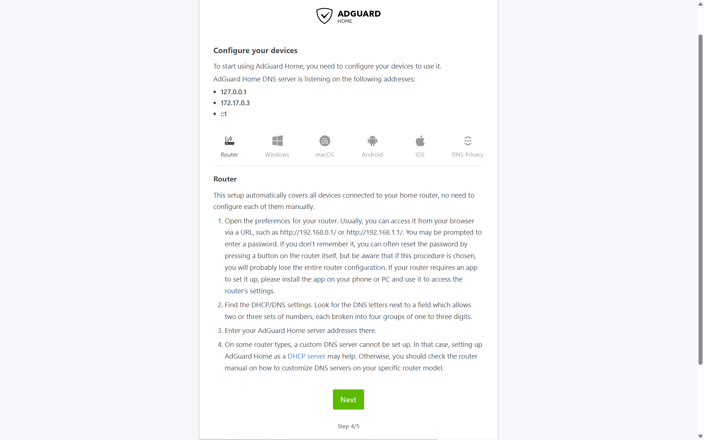
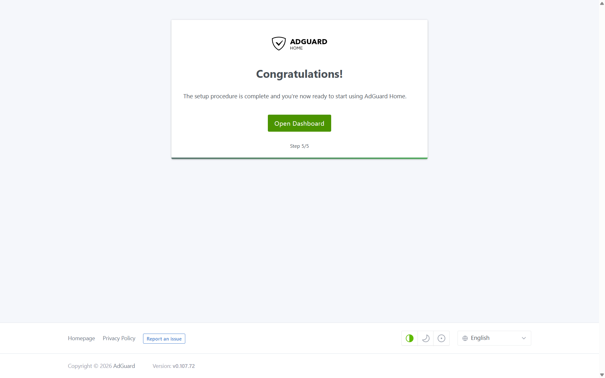
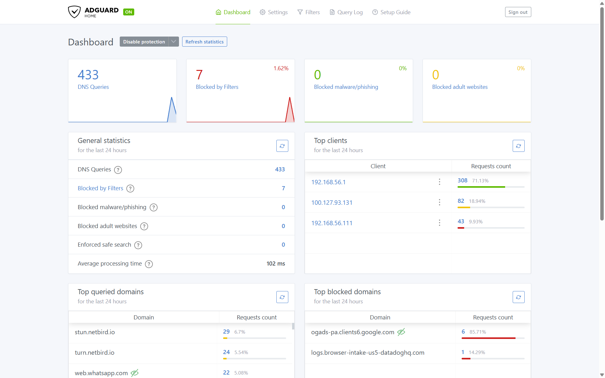
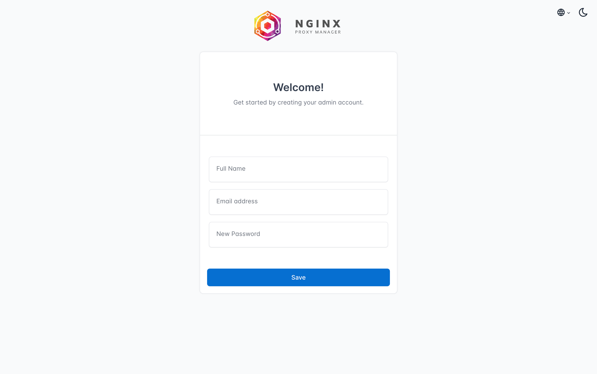
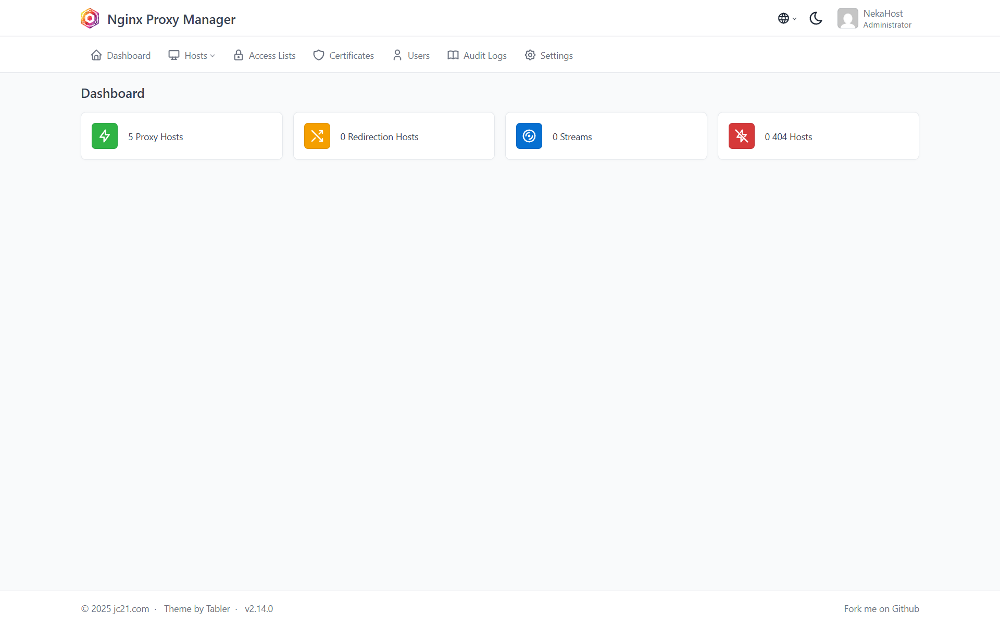

# 🏠 homelab-infra-gateway

> **Stack infrastruktur jaringan sekelas produksi untuk lingkungan self-hosted.**
> Berhenti mengekspos layanan secara langsung. Mulailah melakukan routing secara cerdas, enkripsi otomatis, dan filtering di level DNS — semuanya di dalam infrastruktur milik Anda sendiri.

[](https://docs.docker.com/compose/)
[](https://nginxproxymanager.com/)
[](https://adguard.com/en/adguard-home/overview.html)
[](LICENSE)
[]()

> 🌐 **Baca dokumentasi ini dalam bahasa lain:** [English](README.md)

---

## 📖 Gambaran Umum

Repositori ini menyiapkan **lapisan gateway jaringan fondasi** untuk homelab atau infrastruktur kantor kecil berbasis self-hosted. Stack ini dirancang di sekitar dua kebutuhan kritis: **manajemen trafik** dan **keamanan di level jaringan**.

| Komponen | Peran |
| :--- | :--- |
| **Nginx Proxy Manager** | Mesin reverse proxy dengan dashboard GUI. Menangani terminasi SSL/TLS via Let's Encrypt, aturan routing, dan kontrol akses — tanpa perlu menyentuh satu pun file konfigurasi Nginx secara manual. |
| **AdGuard Home** | DNS server self-hosted yang memblokir iklan, tracker, dan domain berbahaya di level jaringan — sebelum satu paket pun mencapai perangkat. Tidak membutuhkan ekstensi browser di sisi klien. |

Keduanya membentuk sebuah **control plane ingress dan DNS yang terpadu**, ringan, mudah diaudit, dan sepenuhnya dikelola sendiri.

---

## 🗺️ Arsitektur Jaringan

Diagram di bawah menggambarkan bagaimana trafik mengalir melalui stack ini: semua permintaan masuk melewati NPM, yang kemudian melakukan routing ke layanan-layanan internal melalui jaringan Docker yang terdedikasi. Semua kueri DNS dari perangkat LAN diselesaikan oleh AdGuard Home sebelum diteruskan ke upstream.



> 💡 *Tips: Anda dapat membuat diagram ini menggunakan [draw.io](https://draw.io), [Excalidraw](https://excalidraw.com), atau [Mermaid Live Editor](https://mermaid.live).*

---

## ✅ Prasyarat

Sebelum melakukan deployment, pastikan mesin host Anda memenuhi persyaratan berikut:

- **OS:** Distribusi Linux modern apa pun (Debian 12, Ubuntu 22.04 LTS, atau setara, direkomendasikan).
- **Runtime:** Docker Engine `≥ 24.x` dan Docker Compose Plugin `≥ 2.x` sudah terinstal.
- **Hak Akses:** Pengguna non-root dengan akses `sudo` dan terdaftar dalam grup `docker`.
- **Jaringan:** Port-port berikut harus **bebas dan tidak digunakan** sebelum deployment.

### 🔌 Referensi Port

| Layanan | Port Host | Port Container | Protokol | Keterangan |
| :--- | :---: | :---: | :---: | :--- |
| **NPM** | `80` | `80` | TCP | Ingress HTTP standar (reverse proxy). |
| **NPM** | `443` | `443` | TCP | Ingress HTTPS/SSL standar (reverse proxy). |
| **NPM UI** | `81` | `81` | TCP | Dashboard admin Nginx Proxy Manager. |
| **AdGuard DNS** | `53` | `53` | TCP/UDP | Port resolusi DNS standar. **Wajib kosong.** |
| **AdGuard Setup** | `3000` | `3000` | TCP | Wizard setup awal (hanya saat pertama kali dijalankan). |
| **AdGuard UI** | `8080` | `80` | TCP | Dashboard admin setelah setup selesai. |

> ⚠️ **Penting — Konflik Port 53 di Debian/Ubuntu:**
> Sistem Ubuntu dan Debian modern menjalankan `systemd-resolved` yang mengikat diri ke port `53` secara default. Ini **pasti** akan menyebabkan konflik. Selesaikan masalah ini sebelum melakukan deployment:
>
> ```bash
> # Nonaktifkan stub listener milik systemd-resolved
> sudo sed -i 's/#DNSStubListener=yes/DNSStubListener=no/' /etc/systemd/resolved.conf
> sudo systemctl restart systemd-resolved
>
> # Verifikasi bahwa port 53 kini sudah bebas
> sudo ss -tulpn | grep ':53'
> ```

---

## 🚀 Cara Deploy

### 1. Clone Repositori

```bash
git clone https://github.com/<username-anda>/homelab-infra-gateway.git
cd homelab-infra-gateway
```
### 2. Jalankan Stack

```bash
docker compose up -d
```

Verifikasi bahwa semua container berjalan dan dalam keadaan sehat:

```bash
docker compose ps
docker compose logs -f
```

---

## 🛠️ Setup Pasca-Instalasi

Setelah stack berjalan, setiap layanan memerlukan inisialisasi satu kali melalui antarmuka web-nya masing-masing.

---

### 1 · AdGuard Home — Wizard Setup Awal

Wizard setup AdGuard Home hanya tersedia di port `3000` pada saat pertama kali dijalankan. Setelah selesai, dashboard admin akan berpindah secara permanen ke port `8080`.

**Buka wizard setup melalui browser:**

```
http://<IP-HOST>:3000
```



**Ikuti langkah-langkah wizard berikut:**

1. **Memulai** — Tinjau layar selamat datang, lalu klik **Get Started**.

2. **Admin Web Interface** — Saat diminta mengatur port untuk Web Interface, **biarkan tetap di `80`**. Docker Compose sudah memetakan port container `80` → port host `8080`, sehingga konfigurasi ini sudah benar.

   

3. **DNS Server** — Biarkan alamat listen DNS server tetap di `All Interfaces:53`. Ini memungkinkan semua perangkat di LAN menggunakan AdGuard sebagai resolver DNS mereka.

   

4. **Autentikasi** — Buat **username** dan **password** yang kuat untuk akun admin.

   

5. **Konfigurasi Perangkat Anda** — AdGuard Home akan menampilkan alamat DNS yang sedang didengarkannya, beserta panduan konfigurasi per platform (Router, Windows, macOS, Android, iOS, dan DNS Privacy). Untuk cakupan terluas tanpa perlu konfigurasi per perangkat, ikuti tab **Router**: arahkan field DNS DHCP di router Anda ke IP host, dan seluruh perangkat di jaringan akan otomatis menggunakan AdGuard sebagai resolver-nya.

   

   > 💡 *Alamat yang ditampilkan (misalnya `127.0.0.1`, `172.17.0.3`) adalah alamat jaringan Docker internal tempat AdGuard terikat. Untuk filtering DNS di seluruh LAN, gunakan **IP LAN mesin host** Anda (misalnya `192.168.1.x`) saat mengonfigurasi pengaturan DNS di router.*

   Klik **Next** untuk melanjutkan.

6. **Selesai** — Wizard akan menampilkan layar konfirmasi **"Congratulations!"** yang menandakan bahwa prosedur setup telah berhasil diselesaikan. Klik **Open Dashboard** untuk diarahkan ke antarmuka admin utama.

   

Setelah setup selesai, dashboard admin dapat diakses secara permanen di:

```
http://<IP-HOST>:8080
```

7. **Dashboard Admin** — Anda kini berada di dalam panel kontrol AdGuard Home. Dari sini Anda dapat memantau statistik kueri DNS secara real-time, mengelola blocklist, meninjau query log, serta mengonfigurasi upstream DNS resolver.

   
---

### 2 · Nginx Proxy Manager — Setup Pertama Kali

Akses dashboard admin NPM di:

```
http://<IP-HOST>:81
```

Pada saat pertama kali dijalankan, NPM **tidak** menampilkan halaman login. Sebagai gantinya, NPM menampilkan wizard **"Welcome!"** yang meminta Anda untuk langsung membuat akun admin baru.



Isi kolom-kolom berikut, lalu klik **Save**:

| Field | Keterangan |
| :--- | :--- |
| **Full Name** | Nama tampilan Anda (misalnya `Admin`). |
| **Email Address** | Ini akan menjadi username login Anda ke depannya. Gunakan alamat yang valid. |
| **New Password** | Pilih password yang kuat. Tidak ada password default — Anda menentukan sendiri dari awal. |

> ⚠️ **Tidak ada kredensial default yang bisa dicoba.** NPM mengharuskan Anda mendefinisikan akun admin sendiri pada akses pertama. Simpan kredensial ini di tempat yang aman.

Setelah mengklik **Save**, Anda akan diarahkan langsung ke dashboard admin utama NPM. Anda kini siap membuat **Proxy Host** pertama Anda dan menerbitkan sertifikat SSL via Let's Encrypt.


---

## 🔒 Catatan Keamanan & Hardening

Men-deploy infrastruktur tanpa hardening adalah sebuah kelalaian operasional. Langkah-langkah berikut **sangat direkomendasikan** untuk segera dilakukan setelah deployment.

### Segera Ganti Kredensial Default

NPM dilengkapi dengan kredensial default yang sudah diketahui publik (`admin@example.com` / `changeme`). Kredensial ini wajib diganti saat login pertama. Jangan operasikan stack ini dengan kredensial default, bahkan di lingkungan LAN yang terpercaya sekalipun.

### Batasi Akses UI Manajemen Hanya ke Jaringan Lokal / VPN

Port `81` (NPM UI) dan `8080` (AdGuard UI) adalah **antarmuka manajemen** dan tidak boleh bisa dijangkau dari internet publik dalam kondisi apa pun. Terapkan pembatasan ini di level firewall:

```bash
# Contoh menggunakan UFW: Izinkan port UI hanya dari subnet lokal Anda
sudo ufw allow from 192.168.1.0/24 to any port 81
sudo ufw allow from 192.168.1.0/24 to any port 8080

# Tolak akses dari mana pun selain itu
sudo ufw deny 81
sudo ufw deny 8080
```

Jika homelab Anda diakses dari jarak jauh, letakkan port-port ini di belakang **VPN** (misalnya WireGuard) daripada mengeksposnya secara langsung.

### AdGuard DNS — Arahkan Perangkat LAN ke IP Host

Agar AdGuard dapat memfilter seluruh jaringan Anda, konfigurasikan server DHCP di router untuk mengiklankan IP mesin host sebagai **DNS server utama**. Dengan ini, semua perangkat yang terhubung akan otomatis melakukan resolusi DNS melalui AdGuard Home tanpa perlu konfigurasi per perangkat.

### Aktifkan HTTPS untuk Semua Layanan yang Diproksikan

Gunakan NPM untuk menerbitkan sertifikat Let's Encrypt pada setiap layanan internal yang diproksikan melaluinya. Hindari mengoperasikan layanan melalui HTTP biasa, bahkan di dalam LAN sekalipun, untuk mencegah intersepsi kredensial di jaringan yang digunakan bersama.

### Tinjau Blocklist AdGuard Secara Berkala

Blocklist default adalah titik awal yang baik, namun menyesuaikannya dengan lingkungan Anda dapat mencegah *false positive*. Tinjau **Query Log** di dashboard AdGuard secara berkala dan tambahkan domain-domain legitimate yang mungkin salah diblokir ke dalam daftar putih (whitelist).

---

## 📁 Struktur Repositori

```
homelab-infra-gateway/
├── docker-compose.yml      # Definisi utama stack
├── .env.example            # Template environment variable
├── assets/                 # Screenshot dan diagram arsitektur
│   ├── architecture-diagram.png
│   ├── adguard-setup-1.png
│   └── npm-dashboard.png
├── README.md               # Dokumentasi (Bahasa Inggris)
└── README.id.md            # Dokumentasi (Bahasa Indonesia)
```

---

## 🤝 Kontribusi & Masukan

Repositori ini merupakan bagian dari portofolio infrastruktur pribadi. *Issue*, saran, dan *pull request* sangat disambut. Jika Anda mengadaptasi stack ini untuk homelab atau lingkungan kantor Anda sendiri, jangan ragu untuk membuka diskusi.

---

<p align="center">
  Dibangun dengan niat yang disengaja. Dirancang untuk keandalan. Dirawat dengan sepenuh hati.
  <br/>
  <sub>© 2025 · Portofolio Infrastruktur Self-Hosted</sub>
</p>
